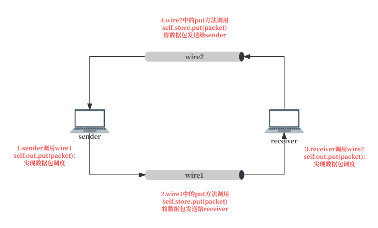

:标题: SR Sender实验说明

:作者:
 - yangfan
 - zhengbw

:时间: 2023年8月6日

==============
SR Sender Lab
==============

Overview
========

选择性重传(Selective Repeat)是自动重复请求(ARQ)的一部分。使用选择性重复，发送方发送由窗口大小指定的帧数，甚至不需要像Go-Back-N ARQ中那样等待接收方的单个ACK。接收端可以选择性地拒绝单个帧，该帧可以单独重传；这与其他形式的ARQ形成了鲜明的对比，后者必须从那个点再次发送每一帧。在选择性重传协议中，接收端接收乱序帧并缓冲它们，发送方分别重新传输已经超时的帧。

在这个实验中，你的任务是实现一个搭建在OpenNetLab上的使用SR协议的发送端。

Getting Started
---------------

1. :download:`下载实验资源 <./resources/sr.zip>` ，解压后进入sr文件夹，其中包含两个子文件夹，:file:`resource` 文件夹中包含完成该实现所需阅读的文档以及实验报告模板，:file:`code` 文件夹中包含基础的实验代码模板。实验代码包含如下文件：

   - :file:`main.py` ：本地调试运行文件；
   - :file:`receiver.py` ：接收方文件，无需修改；
   - :file:`sender.py` ：发送方文件， `TODO` 部分待编写。
   - :file:`testcases.json` ：本地评测配置文件。
   - :file:`tester` ：本地评测运行文件，使用说明见相关文档。

2. 阅读实验任务，完成代码模板中 `TODO` 部分的代码片段。

3. 进行本地测试，完成本地测试后将代码提交到OpenNetLab在线平台进行远程评测。

Tasks
-----

在这个实验中，你需要实现sender.py中的send_available方法以及put方法的设计，并且遵循SR协议：

- 在send_available方法中需要满足以下几点:

  - 当收到接收方的确认后，判断该确认是否合法。如果不合法的话，什么也不做；如果合法的话，将对应缓冲区中的帧标记为被确认，如果被确认的帧位于滑动窗口头部，移动滑动窗口直到头部的帧未被确认，并且发送接下来可以发送的帧。
  - 每发送一个帧时，保存该帧在缓冲区中。
  - 每个缓冲区内的帧对应一个定时器，当定时器超时的时候，重新发送对应的帧。

- put方法表示接收来自receiver数据，由相应的Wire实例调用，用于接收来自receiver的确认数据包。

该实验 `TODO` 部分的伪代码如下：

.. code-block:: text

    function send_available(packet) {
        # sender初始化时已定义相应的 buffer 和 times
        create buffer : outbound: Deque[QueueItem] = deque()
        create times  : timers: Deque[Timer] = deque()
        if len(buffer) > 0 and the head of buffer is acked:
            update buffer
            update times

        while (condition) {
            send packets
            add these packets to buffer and times
        }
    }

    # 实验模板已经给出send_packet方法的具体实现
    def send_packet(self, packet: Packet):
            self.dprint(f"send {packet.payload} on seqno {packet.packet_id}")
            assert self.out
            self.out.put(packet)

    func put(packet):
        receive Packet from SR receiver as p
        if p['ackno'] is valid ackno {
            mark the corresponding packet in buffer as acked
            send available packet
        }
        if all packets are sent and acked {
            self.finish_channel.put(True)  //finish_channel表示结束条件
        }

------------

Tips
====

你可以通过 `SR交互演示 <https://www2.tkn.tu-berlin.de/teaching/rn/animations/gbn_sr/>`_ 来帮助自己更好地理解SR的过程。

sender.py和receiver.py中一些属性和方法的解释：

.. py:attribute:: self.seqno_range
   :noindex:

   序号空间大小。请注意序号空间的序号是从0开始的；

.. py:attribute:: self.window_size
   :noindex:

   滑动窗口大小；

.. py:attribute:: self.timers
   :noindex:

   发送方的定时器；

.. py:attribute:: self.env
   :noindex:

   程序运行的环境；

.. py:attribute:: self.debug
   :noindex:

   控制运行过程中日志信息输出，可以设置为True以方便调试；

.. py:attribute:: self.proc
   :noindex:

   发送方的进程；

.. py:function:: new_packet(self, seqno, data) -> Packet
   :noindex:

   将需要传输的信息内容封装为一个数据包；

   @参数: seqno - 数据包的序列号

   @参数: data - 数据包所携带的数据内容

   @返回类型: 已封装好的一个数据包实例

.. py:function:: timeout_callback(self, packet)
   :noindex:

   超时处理的回调函数，当sr sender中的超时器超时会自动调用该函数，该函数发送指定的数据包；

   @参数: packet - 需要发送的一个数据包实例

.. py:function:: send_packet(self, packet)
   :noindex:

   发送数据包packet到receiver；

   @参数: packet - 需要发送的一个数据包实例

.. py:function:: run(self, env) 
   :noindex:

   在给定的环境中运行发送端；

   @参数: env - 程序的运行环境；

.. py:function:: put(self, packet)
   :noindex:

   处理确认数据包并且发送余下的数据；

   @参数: packet - sender接受到的来自receiver的确认数据包

.. py:function:: dprint(self, msg)
   :noindex:

   打印运行日志信息。

   @参数: msg - 需要打印的信息

------------

Testing
=======

1. 进行本地测试

在本机运行 *main.py* 程序。 *main.py* 程序会使用本地的一个测试用例对SR发送端的正确性进行评测并输出运行日志。

.. code-block:: shell

    python3 main.py

.. note::
    `main.py` 首先实例化类 `Environment` ，创建一个基于事件的网络模拟执行环境。然后 `main.py` 在模拟环境中实例化 GBNsender、GBNreceiver、Wire 类，创建由 `sender` , `receiver` , `wire1` , `wire2` 构成的网络回路进行数据包传输，`Wire` 类主要目的是实现 `sender` 与 `receiver` 之间不可靠的数据传输（模拟数据包的发送时延、丢失和乱序的情况），流程主要分为四步：

    1. `sender` 通过 `wire1` 实现数据包的发送
    2. `receiver` 通过 `wire1` 中的方法，获取 `sender` 发送的数据包
    3. `receiver` 通过 `wire2` 实现数据包的发送
    4. `sender` 通过 `wire2` 中的方法，获取 `receiver` 发送的确认数据包

   main.py 模拟流程

完成程序基本功能的调试后，可以运行可执行文件 `tester` 进行多个测试用例评测，更详细的使用说明见 `相关文档 <./tester.html>`_

2. `提交代码进行远程评测 <../platform/intro.html>`_
